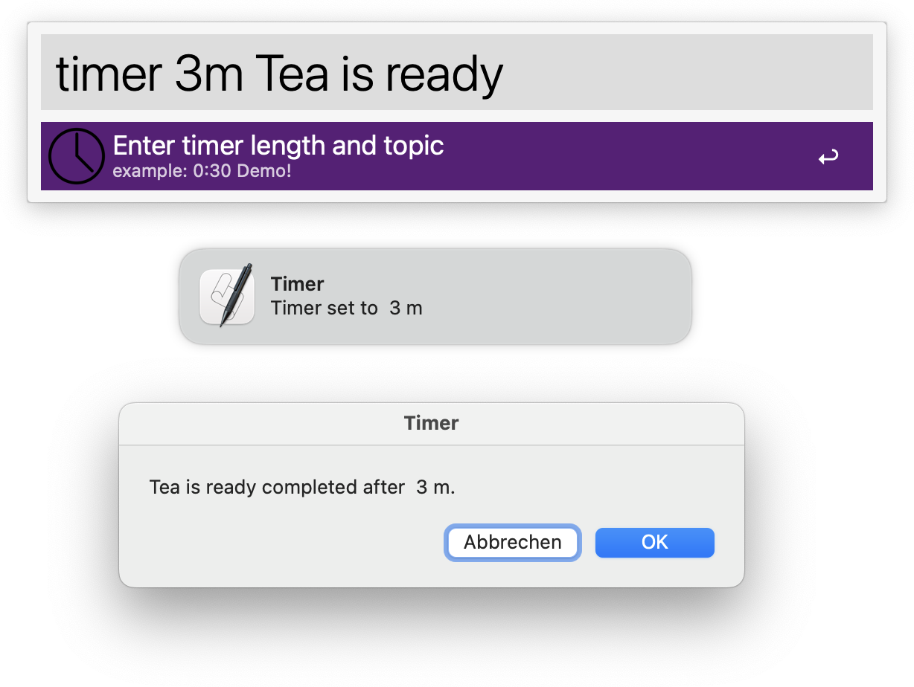

# TTimer

Simple timer workflow for [Alfred](https://www.alfredapp.com). Will set a timer and open a dialogue after the specified time period. Unlike other timers that use notifications (which fade out and might be missed), this one uses a dialogue window.

## Usage

    timer :30

or 

    timer 30s

Sets a 30-second timer. Using `timer 30` or `timer 30m` would be a 30-minute timer. You can also give it a name

    timer 3:30 Tea is ready!

Which will remind you that *"Tea is ready!"* after 3 minutes and 30 seconds. You could also have used `3m30s` or `3m30`.

## Installation

Download the Alfred Workflow File from [releases](https://www.github.com/birnstiel/ttimer/releases) and double-click to install.